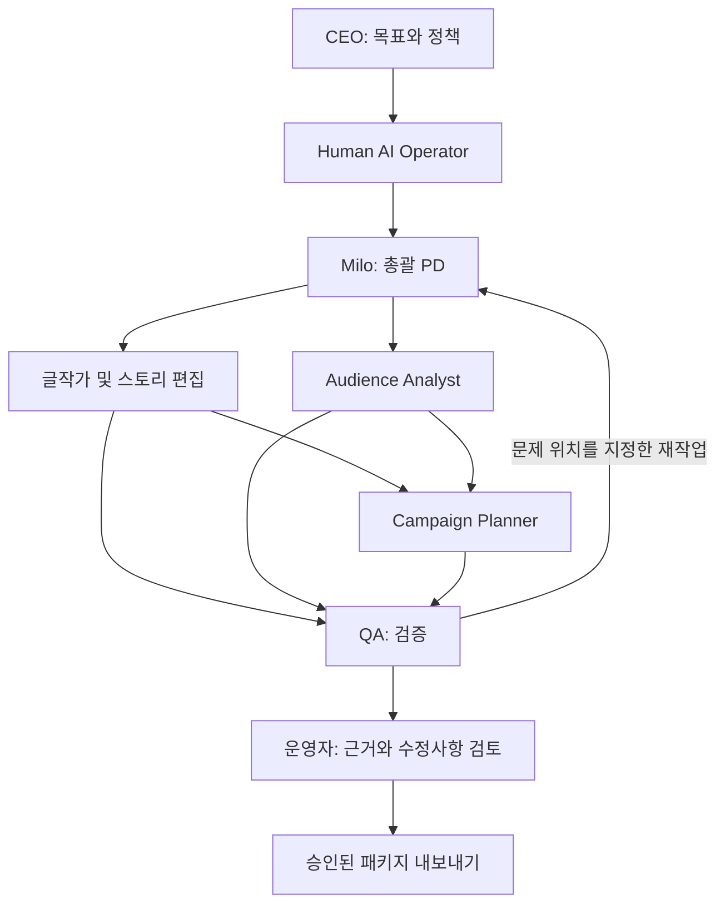

# ORBIT

**AI Studio Operating System**

**가상의 웹툰 스튜디오 NOVA INK Studios를 배경으로, 멀티 에이전트 오케스트레이션을 실험·평가하기 위해 설계한 프로젝트입니다.**

에이전트의 역할 분담, 작업 의존성, 결과 검증, 선택적 재작업, 사람의 승인과 장애 복구를 하나의 시나리오에서 검증하는 것이 목적입니다. 실제 회사의 운영 서비스가 아닙니다.

**A fictional studio. A testbed for multi-agent orchestration.**

웹툰 도메인을 아는 운영자 한 명이 AI 팀에 일을 맡기고, 근거를 검토하고, 필요한 작업만 다시 수행하게 만드는 스튜디오 운영 콘솔.

> **Local prototype · v0.3 · 2026-09-28**
> 현재는 합성 데이터로 실행 가능한 로컬 프로토타입입니다. 실제 모델 호출은 기본 비활성화되어 있으며, 모델 성능이나 실제 회사 운영 실적을 주장하지 않습니다. 현재 구현 범위는 [구현 상태](docs/07-implementation-status.md)를 우선 참고하세요. 브랜드 이름의 사용 가능성은 검증하지 않았습니다.

## 회사와 제품

**NOVA INK Studios**는 가상의 웹툰·IP 스튜디오이며, **ORBIT**는 운영자가 AI 팀의 작업·검수·승인을 관리하는 제품입니다. 이 저장소는 ORBIT의 설계를 담고, NOVA INK Studios는 첫 사용 시나리오가 됩니다.

```text
NOVA INK STUDIOS
Global Webtoon Entertainment
Stories, run differently.

        powered by

ORBIT
AI Studio Operating System
```

회사 브랜드는 작품과 IP를, 제품 브랜드는 운영 경험을 설명합니다. ‘Global’은 브랜드 방향이며 실제 해외 사업 실적을 뜻하지 않습니다. ‘Operating System’은 스튜디오 업무 운영을 뜻하며 컴퓨터 운영체제를 뜻하지 않습니다.

## 왜 만들까

AI에게 원고 검토와 홍보 문안 작성을 각각 시킬 수는 있습니다. 그러나 운영자는 여전히 어떤 자료를 읽었는지, 서로 다른 결과가 왜 충돌하는지, 무엇을 다시 시켜야 하는지를 직접 정리해야 합니다.

이 프로젝트의 가설은 **역할별 작업, 버전이 있는 산출물, 근거, 승인, 재작업을 하나의 흐름으로 묶으면 운영자의 검토 부담을 줄일 수 있다**는 것입니다. 에이전트 수 자체는 성과 지표가 아닙니다. 단일 에이전트와 고정 워크플로보다 이점이 없으면 구조를 단순화합니다.

## 스튜디오 역할

| 에이전트 | 화면에서의 역할 | 책임 |
| --- | --- | --- |
| Milo | 총괄 PD | 계획·작업 배분·일정·재작업 조율 |
| Story Writer & Editor | 글작가·스토리 편집 | 설정 검토와 지정 장면의 대사·수정 원고 초안 |
| Audience Analyst | 독자 분석 담당 | 합성 독자 반응 분석 |
| Campaign Planner | 마케팅 담당 | 홍보 문안 기획 |
| QA | 최종 검수 담당 | 근거·설정·스포일러 검수 |

첫 버전은 글작가와 편집 역할을 하나로 묶고 QA가 별도로 검수합니다. 기존 원고를 입력으로 받아 필요한 장면의 수정 초안을 제안하며, 회차 전체를 처음부터 자동 집필하는 기능은 후속 범위입니다. 원고와 설정집 원본은 덮어쓰지 않고 초안을 별도 산출물로 저장합니다. Milo와 QA에는 최종 승인권이 없으며 사람이 결정합니다.

## 첫 번째 미션

가상 작품 《별빛식당》 EP.12의 공개 준비 패키지를 만든다.

1. 운영자가 원고·작품 설정집·가상 독자 반응과 목표를 등록한다.
2. 총괄 PD Milo가 작업 계획을 제시하고 운영자가 범위와 비용 상한을 확정한다.
3. Story Writer & Editor가 설정 일관성과 필요한 수정 초안을, Audience Analyst가 독자 반응을 검토한다.
4. Campaign Planner가 두 결과를 받아 스포일러 없는 홍보 문안을 작성한다.
5. QA가 근거 누락과 충돌을 검사한다. 실패한 산출물과 그에 의존하는 작업만 다시 수행한다.
6. 운영자가 변경 전후와 근거를 확인하고 공개 준비 패키지를 승인한다.

**MVP의 완료는 ‘검토된 패키지 내보내기’입니다. 실제 연재, 광고 결제, 외부 메시지 발송은 하지 않습니다.**



## 제품의 인상

스튜디오를 운영하는 느낌은 살리되, 중요한 정보는 작업 상태·근거·비용·결정 대기입니다. 캐릭터 아바타는 역할을 기억하게 돕고, 조직도의 연결선은 실제 작업 의존성을 보여줍니다. 움직이는 아바타나 생성된 대화량으로 진행률을 꾸미지 않습니다.

| 화면 | 운영자가 해결하는 문제 |
| --- | --- |
| Studio | 지금 막힌 일과 내가 결정해야 하는 일은 무엇인가? |
| Organization | 누가 어떤 역할·도구·자료 접근권을 갖는가? |
| Missions | 이번 목표의 산출물과 재작업은 어디까지 진행됐는가? |
| Agent Lab | 같은 과제에서 어떤 에이전트 설정이 더 나은가? |
| Audit | 어떤 입력과 버전으로 이 결과가 만들어졌는가? |

## 제안 기술 스택

아래 표는 전체 설계의 기술 선택입니다. 현재는 Next.js·React·TypeScript·React Flow, FastAPI·Pydantic·SQLAlchemy, LangGraph와 mock 실행을 구현했습니다. Tailwind 대신 일반 CSS를 사용하며 Alembic과 PostgreSQL/Supabase 통합 검증은 후속입니다. 설치 버전은 requirements.txt와 package-lock.json에 고정했습니다.

| 영역 | 기술 | 이 프로젝트에서의 용도 |
| --- | --- | --- |
| 운영 화면 | Next.js, React, TypeScript | Studio, Missions, Agent Lab UI |
| 스타일 | Tailwind CSS | 상태 카드와 검토 패널의 일관된 스타일 |
| 그래프 | React Flow | 조직도와 작업 의존성 시각화 |
| API | Python, FastAPI, Pydantic | 미션·승인 API와 입력·출력 구조 검증 |
| 오케스트레이션 | LangGraph | 상태 기반 역할 실행, 분기, 중단·재개 |
| 저장소 | PostgreSQL — 로컬 개발 / Supabase Free 데모 | 미션, 산출물 버전, 승인, 감사 이벤트, 체크포인트 |
| DB 접근 | SQLAlchemy, Alembic | 업무 데이터 접근과 스키마 변경 관리 |
| 실시간 상태 | SSE | 서버에서 UI로 작업 이벤트 전달 |
| 모델 | 제공자별 어댑터 + mock | 초기에는 모의 응답, 이후 선정한 모델로 비교 실험 |
| 검증 | pytest, Playwright | 상태·권한·복구 검증과 UI 흐름 검증 |
| 로컬 환경 | Docker Compose | 향후 DB·API·실행기·UI 개발 환경 구성 |

LangGraph는 실행 흐름을 담당하고, FastAPI는 사용자 요청과 권한을 담당합니다. 모델의 출력 구조가 맞는지는 Pydantic으로 검증하되, 내용의 정확성은 근거 검사와 평가로 별도 검증합니다. PostgreSQL의 업무 레코드와 LangGraph 체크포인트는 논리적으로 분리합니다.

처음에는 Redis, 별도 벡터 DB, 여러 오케스트레이션 프레임워크를 함께 도입하지 않습니다. 실행 관측은 DB 이벤트부터 시작하고 외부 추적 서비스는 필요할 때 검토합니다.

참고: [Next.js](https://nextjs.org/docs), [FastAPI](https://fastapi.tiangolo.com/), [LangGraph](https://docs.langchain.com/oss/python/langgraph/overview), [React Flow](https://reactflow.dev/).

## DB 운영과 비용

개발은 로컬 PostgreSQL, 공개 데모는 Supabase Free의 PostgreSQL을 사용하는 계획입니다. PostgreSQL 자체는 무료 오픈소스이며 Supabase는 이를 호스팅하는 서비스입니다. DB 엔진과 업무 스키마를 유지하고 환경별 연결 설정을 바꿉니다.

Supabase Free의 용량·프로젝트 수·비활성 일시정지 제한은 [공식 요금표](https://supabase.com/pricing)를 배포 시 다시 확인합니다. 실행 로그와 체크포인트의 보존량을 관리하고, 데모 전 DB 가용성을 확인합니다. 무료 한도 초과 시 자동 유료 전환을 전제로 하지 않습니다. 실제 모델 API와 API·worker 호스팅 비용은 별도입니다. 아직 클라우드 프로젝트를 생성하거나 연결하지 않았습니다.

## 저장소 구성

```text
orbit-studio-os/
├── data/
│   └── README.md          # 합성 EP.12 자료와 데이터 방침
├── docs/                  # 제품, UX, 실행 계약, 평가, 로드맵
├── src/
│   └── README.md          # backend/ 실행 로직 · web/ 운영 화면
├── .env.example           # 실제 비밀값이 없는 환경변수 설계 예시
├── .gitignore
├── README.md
└── architecture.md        # 전체 구조와 기술 선택의 진입 문서
```

현재 data/episode-12.json에는 합성 자료가, src/backend/와 src/web/에는 API·실행 로직·화면이 있습니다. README는 기존 파일명인 `README.md`를 사용하고 환경변수 예시는 공백 없이 `.env.example`로 둡니다.

## 로컬 실행

**실제 모델 호출은 꺼져 있습니다.** 키가 있어도 자동 호출하지 않습니다. 도구·라우팅·상태·기억·평가·추적을 먼저 mock으로 검증하며, live 테스트는 사용자 승인 후 별도로 진행합니다.

Python 3.11+와 Node.js 20.9+가 필요합니다. 아래는 Windows PowerShell 기준입니다.

```powershell
python -m venv .venv
.\.venv\Scripts\python.exe -m pip install -r requirements.txt
.\.venv\Scripts\python.exe -m uvicorn orbit.api:app --app-dir src/backend --host 127.0.0.1 --port 8000 --workers 1
```

다른 터미널에서:

```powershell
cd src/web
npm ci
npm run dev
```

[로컬 화면](http://127.0.0.1:3000)을 열어 새 미션 → 작업 범위 → 모의 응답 → 실행 → 결과 검토 → 수정 요청 또는 승인 → 패키지 내보내기를 진행합니다. Audit에서 도구·평가·호출 기록을 확인합니다.

DATABASE_URL이 없으면 work/studio.db의 SQLite를 사용하고 화면에 sqlite로 표시합니다. PostgreSQL은 compose.yaml의 로컬 DB/API 구성으로 실행할 수 있으나 현재 환경에서는 검증하지 않았습니다. Supabase Free 연결, 인증과 외부 배포도 아직 하지 않았습니다. **API와 UI는 로컬 전용이며 인터넷에 공개하지 마세요.**

.env는 Git에서 제외되며 기존 파일을 덮어쓰지 않습니다. .env.example은 비밀값 없는 설정 설명입니다. 현재 worker는 API 내 단일 작업 루프이므로 반드시 workers=1로 실행합니다.

## 검증

```powershell
.\.venv\Scripts\python.exe -m pytest -q
cd src/web
npm run build
```

테스트는 별도 임시 DB와 mock을 사용하고 live 호출을 차단합니다. Playwright 시나리오는 src/web/tests/에 있으며 API/UI를 실행한 후 로컬 테스트 환경에서 사용할 수 있습니다. 실행 검증 결과와 한계는 [구현 상태](docs/07-implementation-status.md)에 기록합니다.

## 설계 문서

- [전체 아키텍처와 기술 스택](architecture.md)

- [제품 범위와 성공 기준](docs/01-product.md)
- [화면 구조와 시연 시나리오](docs/02-experience.md)
- [시스템 구조와 실행 계약](docs/03-architecture.md)
- [평가와 Agent Hiring](docs/04-evaluation.md)
- [구현 순서와 검증할 가설](docs/05-roadmap.md)
- [기술 참고 자료와 결정 근거](docs/06-references.md)

공개 자료에는 가상의 작품과 합성 데이터만 사용합니다. 개인 대화 원문, 실명, 미공개 원고와 인증 정보는 포함하지 않습니다. 라이선스는 아직 선택하지 않았습니다.
