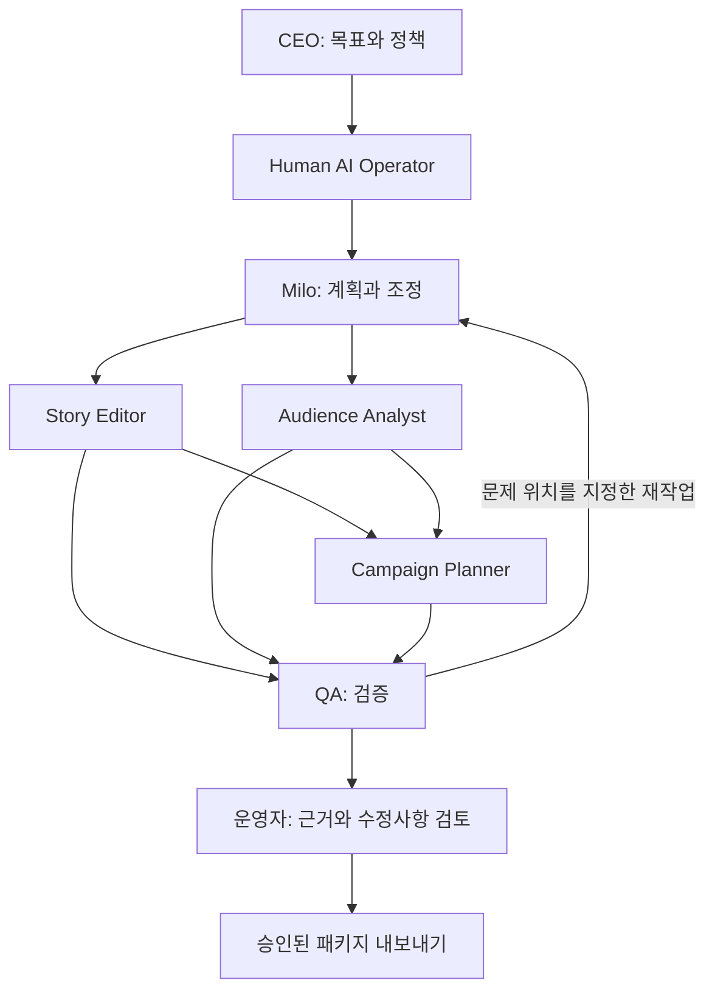

# ORBIT

**AI Studio Operating System**

NOVA INK Studios의 운영을 지원하는 AI 스튜디오 운영 제품입니다.

**One human operator runs an AI-native webtoon studio.**

웹툰 도메인을 아는 운영자 한 명이 AI 팀에 일을 맡기고, 근거를 검토하고, 필요한 작업만 다시 수행하게 만드는 스튜디오 운영 콘솔.

> **Design proposal · v0.1 · 2026-09-27**
> 현재는 설계 문서만 있는 프로젝트입니다. 실행 가능한 제품, 측정된 성능, 실제 고객 데이터는 포함하지 않습니다. 브랜드 이름의 사용 가능성은 검증하지 않았습니다.

## 회사와 제품

**NOVA INK Studios**는 가상의 웹툰·IP 스튜디오이며, **ORBIT**는 운영자가 AI 팀의 작업·검수·승인을 관리하는 제품입니다. 이 저장소는 ORBIT의 설계를 담고, NOVA INK Studios는 첫 사용 시나리오가 됩니다.

```text
NOVA INK STUDIOS
Global Webtoon Entertainment
Stories, run differently.

        powered by

ORBIT
AI Studio Operating System
```

회사 브랜드는 작품과 IP를, 제품 브랜드는 운영 경험을 설명합니다. ‘Global’은 브랜드 방향이며 실제 해외 사업 실적을 뜻하지 않습니다. ‘Operating System’은 스튜디오 업무 운영을 뜻하며 컴퓨터 운영체제를 뜻하지 않습니다.

## 왜 만들까

AI에게 원고 검토와 홍보 문안 작성을 각각 시킬 수는 있습니다. 그러나 운영자는 여전히 어떤 자료를 읽었는지, 서로 다른 결과가 왜 충돌하는지, 무엇을 다시 시켜야 하는지를 직접 정리해야 합니다.

이 프로젝트의 가설은 **역할별 작업, 버전이 있는 산출물, 근거, 승인, 재작업을 하나의 흐름으로 묶으면 운영자의 검토 부담을 줄일 수 있다**는 것입니다. 에이전트 수 자체는 성과 지표가 아닙니다. 단일 에이전트와 고정 워크플로보다 이점이 없으면 구조를 단순화합니다.

## 첫 번째 미션

가상 작품 《별빛식당》 EP.12의 공개 준비 패키지를 만든다.

1. 운영자가 원고·작품 설정집·가상 독자 반응과 목표를 등록한다.
2. Milo가 작업 계획을 제시하고 운영자가 범위와 비용 상한을 확정한다.
3. Story Editor가 설정 일관성을, Audience Analyst가 독자 반응을 검토한다.
4. Campaign Planner가 두 결과를 받아 스포일러 없는 홍보 문안을 작성한다.
5. QA가 근거 누락과 충돌을 검사한다. 실패한 산출물과 그에 의존하는 작업만 다시 수행한다.
6. 운영자가 변경 전후와 근거를 확인하고 공개 준비 패키지를 승인한다.

**MVP의 완료는 ‘검토된 패키지 내보내기’입니다. 실제 연재, 광고 결제, 외부 메시지 발송은 하지 않습니다.**



## 제품의 인상

스튜디오를 운영하는 느낌은 살리되, 중요한 정보는 작업 상태·근거·비용·결정 대기입니다. 캐릭터 아바타는 역할을 기억하게 돕고, 조직도의 연결선은 실제 작업 의존성을 보여줍니다. 움직이는 아바타나 생성된 대화량으로 진행률을 꾸미지 않습니다.

| 화면 | 운영자가 해결하는 문제 |
| --- | --- |
| Studio | 지금 막힌 일과 내가 결정해야 하는 일은 무엇인가? |
| Organization | 누가 어떤 역할·도구·자료 접근권을 갖는가? |
| Missions | 이번 목표의 산출물과 재작업은 어디까지 진행됐는가? |
| Agent Lab | 같은 과제에서 어떤 에이전트 설정이 더 나은가? |
| Audit | 어떤 입력과 버전으로 이 결과가 만들어졌는가? |

## 설계 문서

- [제품 범위와 성공 기준](docs/01-product.md)
- [화면 구조와 시연 시나리오](docs/02-experience.md)
- [시스템 구조와 실행 계약](docs/03-architecture.md)
- [평가와 Agent Hiring](docs/04-evaluation.md)
- [구현 순서와 검증할 가설](docs/05-roadmap.md)
- [기술 참고 자료와 결정 근거](docs/06-references.md)

공개 자료에는 가상의 작품과 합성 데이터만 사용합니다. 개인 대화 원문, 실명, 미공개 원고와 인증 정보는 포함하지 않습니다. 라이선스는 아직 선택하지 않았습니다.
