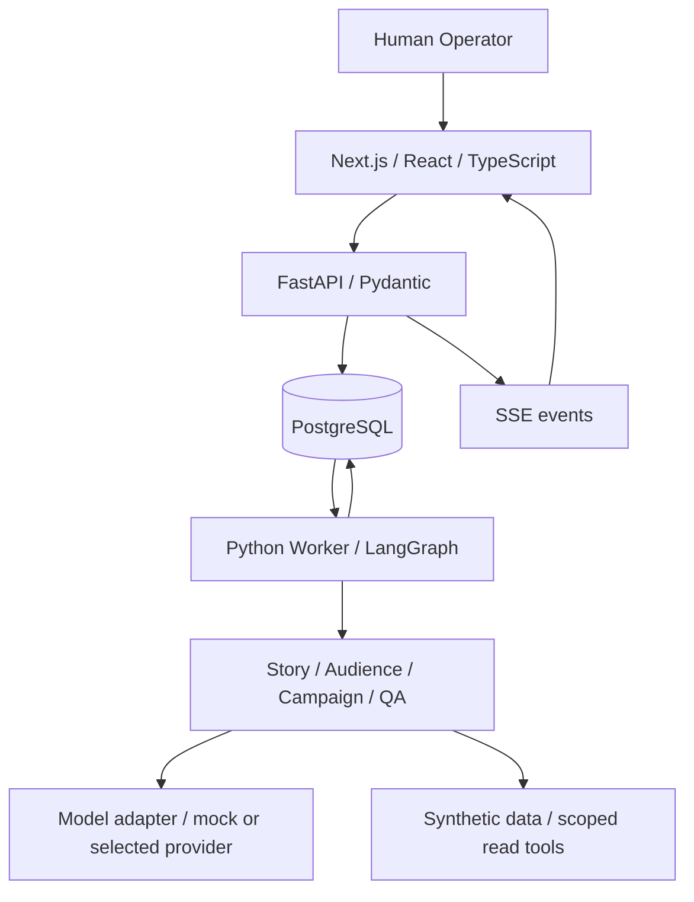

# ORBIT Architecture

> 설계안 · 2026-09-28. 구현 전이며 NOVA INK Studios는 실험을 위한 가상의 회사다.

## 목적

가상의 회차 공개 준비 업무로 단일 에이전트, 고정 워크플로, 제한된 멀티 에이전트 오케스트레이션을 비교한다. 품질, 비용, 지연, 운영자 검토 시간과 실패 후 복구를 측정한다. 브랜드의 “AI Studio Operating System”은 업무 운영 제품이라는 컨셉이다.

## 구조

API는 미션 생성·권한·승인을, 별도 실행기 프로세스는 장시간 작업을 담당한다. DB에 저장된 작업을 실행기가 점유하므로 웹 요청의 수명에 실행을 묶지 않는다. UI의 React Flow 그래프는 서버 상태를 시각화하며 실행의 기준이 아니다.

## 제안 스택과 경계

- **Next.js + React + TypeScript:** 운영 화면. API 권한과 에이전트 실행 로직은 Python 서버에 둔다.
- **Tailwind CSS + React Flow:** 카드·패널 스타일과 작업 그래프. 그래프와 같은 정보를 표로도 제공한다.
- **FastAPI + Pydantic:** API 계약과 구조 검증. 구조 검증은 사실 검증을 대신하지 않는다.
- **LangGraph:** 정해진 외곽 흐름 안에서 상태, 조건 분기, 역할 실행, 사람 개입을 구현한다. 모든 작업을 자유 에이전트로 만들지 않는다.
- **PostgreSQL + SQLAlchemy + Alembic:** 업무 데이터와 마이그레이션. LangGraph 체크포인트는 전용 저장 계층/테이블로 관리하며 업무 승인 레코드와 섞지 않는다.
- **SSE:** 작업 상태를 서버에서 브라우저로 전달한다. 사용자 명령은 일반 HTTP API를 사용한다.
- **모델 어댑터:** 첫 단계는 mock이며 실제 제공자와 모델은 평가 후 정한다. 지시문·도구·모델 버전을 고정해 비교한다.
- **pytest + Playwright:** 상태·승인·재시도·복구 검증과 운영자 흐름 검증.
- **Docker Compose:** 구현 후 로컬 DB·API·worker·web 실행 환경을 재현하는 용도. 현재 구성 파일은 없다.

기술별 버전은 구현 시 호환성 검증 후 잠금 파일에 기록한다. Redis/Celery, 벡터 DB, 외부 관측 플랫폼은 현재 필수 구성에 포함하지 않는다.

## DB 환경

개발: 로컬 PostgreSQL. 공개 데모: Supabase Free의 PostgreSQL. 양쪽에 같은 업무 마이그레이션을 적용하며 DATABASE_URL은 서버에서만 읽는다. Supabase를 별도의 DB 엔진으로 취급하지 않는다.

API와 worker만 DB에 연결한다. 브라우저는 FastAPI를 통해 접근하며 DB 연결 문자열을 전달받지 않는다. Supabase Auth·Storage·Realtime은 이번 결정에 포함하지 않는다. 업무 테이블과 체크포인트는 공개 Data API에 노출되지 않는 서버 전용 영역에 둔다.

구현 시 연결 방식·TLS·네트워크 접근·드라이버·체크포인터 호환성을 검증한다. 마이그레이션과 장시간 worker에 맞는 연결 방식을 선택하고 연결 풀의 동시성을 제한한다. 무료 플랜 일시정지 시 실행을 실패/대기로 표시하고, 복구 후 유효한 체크포인트에서 재개한다.

무료 플랜의 제약은 [공식 요금표](https://supabase.com/pricing)를 배포 시 재확인한다. 감사 이력과 참조 중인 산출물을 보존하면서 불필요한 로그·오래된 체크포인트를 정리하는 정책을 구현한다. API·worker 호스팅과 실제 모델 사용료는 DB 무료 플랜과 별개다. 현재는 운영 계획만 있으며 클라우드 자원을 생성하지 않았다.

## 소스와 데이터 배치

현재 실제 구조는 루트 [README](README.md)를 따른다. 향후 src/web/에는 Next.js 앱을, src/backend/orbit/에는 api, orchestration, agents, tools, storage, evaluation 모듈을 둘 예정이다. 구체적인 패키지 파일과 테스트 디렉터리는 구현할 때 만든다.

[data/README.md](data/README.md)는 합성 자료의 작성·분리·버전 관리 방침을, [src/README.md](src/README.md)는 모듈 책임을 정의한다. .env.example은 설정 설계 예시일 뿐 현재 동작하는 설정이 아니다.

## 실행 원칙

1. 입력 버전과 정책, 예산을 고정하고 운영자가 계획을 확인한다.
2. Story와 Audience의 독립 분석 후 Campaign과 QA를 실행한다.
3. 변경된 산출물의 후손 작업만 재실행하고 독립 결과는 재사용한다.
4. 승인 시 정확한 패키지 hash를 묶는다. 변경되면 이전 승인을 만료한다.
5. 체크포인트와 작업 lease로 복구하며 멱등 키로 중복 내보내기를 막는다.
6. 모델에는 승인권과 외부 게시 권한을 주지 않는다. 초기 종료점은 패키지 내보내기다.

## 상세 설계

이 문서는 구조와 기술 선택의 요약이며 실행 계약의 기준은 [상세 시스템 설계](docs/03-architecture.md)다. [평가](docs/04-evaluation.md), [구현 순서](docs/05-roadmap.md)도 함께 읽는다.

기술 근거: [LangGraph overview](https://docs.langchain.com/oss/python/langgraph/overview), [FastAPI](https://fastapi.tiangolo.com/), [Next.js](https://nextjs.org/docs), [React Flow](https://reactflow.dev/).
