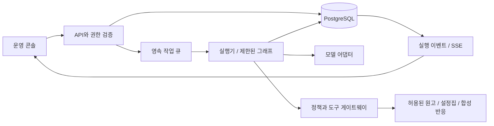

# 시스템 설계

전체 기술 스택과 저장소 배치는 루트 [architecture.md](../architecture.md)를 참고한다. 이 문서는 상세 실행 계약을 정의한다. NOVA INK Studios는 멀티 에이전트 오케스트레이션 실험을 위한 가상의 스튜디오다.

## 기본 결정

이 문서는 제안이며 구현 또는 벤치마크 결과가 아니다. 초기 구성은 Next.js/TypeScript UI, Python/FastAPI/Pydantic API와 작업 실행기, PostgreSQL, LangGraph 기반의 제한된 작업 그래프를 후보로 둔다. 모델 제공자는 고정하지 않고 구조화 출력과 도구 호출을 제공하는 어댑터로 감싼다. 실제 모델·SDK 버전·가격은 구현 시작 시 검증하고 고정한다.

MVP는 하나의 저장소와 DB, API 프로세스와 작업 실행 프로세스로 시작한다. 별도 메시지 브로커·벡터 DB·다중 조직 인프라는 요구가 생기기 전까지 도입하지 않는다. 작은 설정집은 ID 기반 조회와 텍스트 검색으로 충분한지 먼저 검증한다.



DB 환경은 로컬 개발에 PostgreSQL, 공개 데모에 Supabase Free를 사용한다. 상세한 연결·권한·비용 방침은 루트 architecture.md의 DB 환경 절을 따른다.

## 실행 방식

계획의 외곽은 코드로 고정한다: 계획 검토 → 분석 → 문안 작성 → QA → 사람 검토 → 내보내기. Milo는 그 안에서 허용된 역할, 작업 수, 의존성, 재작업 대상을 제안한다. 서버가 순환 의존성·권한·예산을 검증한 뒤에만 실행한다. 자유로운 에이전트 간 무한 채팅은 없다.

Story와 Audience는 입력이 독립적일 때 병렬 실행한다. Campaign은 두 작업의 확정 버전을 기다린다. QA는 세 결과와 원문을 함께 검사한다. QA의 통과가 사람 승인이나 사실의 진실성을 자동 보증하지는 않는다.

| 역할 | 입력 | 출력 | 도구 권한 |
| --- | --- | --- | --- |
| Milo — 총괄 PD | 목표, 정책, 작업 상태 | 검증 가능한 작업 DAG, 다음 조치 | 작업 제안. 직접 데이터 수정 불가 |
| Story Writer & Editor | 원고, 설정집, 지정 장면과 수정 요청 | 설정 충돌 보고서와 수정 원고 초안 | 원본 읽기 전용. 초안은 별도 Artifact로 저장 |
| Audience Analyst | 합성 독자 반응 | 집계와 해석, 표본 한계 | 승인된 데이터 조회와 집계 함수 |
| Campaign Planner | 원고 요약, 검토 결과 | 홍보 문안 3안 | 승인된 입력 조회. 외부 게시 불가 |
| QA | 산출물, 원문, 체크리스트 | 근거별 통과·실패·보류 | 읽기와 검증 함수. 승인 불가 |

Story의 집필 범위는 지정 장면의 수정 초안이다. 원본과 설정집은 바꾸지 않으며 QA가 원문·초안·수정 이유를 독립 검수한다. 운영자 채택 전 초안을 공식 원고로 취급하지 않는다. 초안 변경 시 이를 참조한 Campaign과 QA를 무효화하고 재실행한다.

## 데이터 계약

모든 레코드는 studio_id로 스코프를 제한한다. UUID 식별자를 사용하고 버전이 있는 데이터는 덮어쓰지 않는다.

| 엔터티 | 핵심 필드 |
| --- | --- |
| Mission | id, goal, status, policy_version, budget_limit, currency, input_manifest, revision |
| AgentConfig | id, version, role, model_id, instruction_hash, tool_allowlist, knowledge_scope, eval_run_id |
| Task | id, mission_id, role_config_version, dependencies, input_versions, status, attempt, lease_until |
| Artifact | id, task_id, version, content_hash, schema_version, content, evidence_refs, author_type |
| Evidence | source_id, source_version, locator, excerpt, claim_id |
| Approval | id, actor_id, decision, package_hash, policy_version, expires_at, created_at |
| RunEvent | id, mission_id, task_id, sequence, event_type, payload_redacted, timestamp |
| CostEntry | task_attempt_id, provider, model, usage, unit_price_snapshot, estimated_cost, billed_cost |
| Export | id, approval_id, package_hash, idempotency_key, status, output_ref |

자료 참조는 `source_id + source_version + locator`로 고정한다. 웹 URL만으로 재현성을 주장하지 않는다. 후속 웹 검색을 도입하면 조회 시각과 허용된 범위의 발췌를 저장한다.

작업 출력 계약 예시(개념 명세이며 실행 코드가 아님):

```json
{
  "task_id": "story-12",
  "schema_version": "1",
  "status": "needs_revision",
  "artifact_version": 2,
  "findings": [{
    "id": "F-01",
    "severity": "major",
    "claim": "S04의 인물 이름이 설정집 C02와 다릅니다.",
    "evidence": [
      {"source_id": "ep12", "version": 1, "locator": "S04"},
      {"source_id": "bible", "version": 3, "locator": "C02"}
    ],
    "suggested_action": "운영자가 이름 변경 의도 확인"
  }],
  "limitations": ["설정집에 반영되지 않은 의도적 변경일 수 있음"]
}
```

구조 검증 실패는 1회 형식 수정 요청 후 실패 상태로 돌린다. 모르는 값은 null 또는 명시적인 unknown으로 반환하며 모델이 임의로 채우지 않도록 검증한다.

## 상태와 재작업

미션 기본 경로: `draft → planned → running → review_required → approved → exported`.

- 계획 검토 후 운영자의 start만 running으로 전환한다.
- QA 오류는 허용된 재작업 범위 안에서 해당 작업으로 돌아간다. 입력·권한·예산·범위 확대는 planned로 돌려 운영자가 확인한다.
- 운영자 수정 요청은 새 미션 revision을 만들고 영향받는 작업만 running으로 전환한다.
- 실행 중 일시정지는 신규 작업 dispatch를 막고 진행 중 호출은 완료 또는 timeout 후 기록한다. 재개 시 동일 입력 버전을 확인한다.
- 예산 초과 예상·반복 실패는 blocked, 복구 불가능한 실행 오류는 failed, 명시적 중단은 cancelled로 기록한다.
- approved 상태에서 입력이나 산출물을 바꾸면 승인을 만료시키고 review_required로 돌린다.
- exported 패키지는 불변이다. 변경은 새 revision과 새 승인을 요구한다.

Task 상태: `pending / ready / running / succeeded / needs_revision / blocked / failed / cancelled`.

수정된 Artifact를 입력으로 사용한 모든 후손 작업을 stale로 표시한다. 독립적인 성공 결과는 재사용하되 입력 hash가 일치해야 한다. 실행 중 설정 변경은 기존 미션에 전파하지 않는다.

## 장애 복구와 중복 방지

DB에 작업·체크포인트·이벤트를 보존한다. 작업 실행기는 lease와 attempt 번호로 작업을 점유한다. lease 만료 후 재시도하더라도 compare-and-swap으로 현재 attempt의 완료 결과만 채택한다. 고아 호출의 사용량도 비용에 반영한다.

트랜잭션 안에서 상태 변경과 outbox 이벤트를 함께 기록한다. UI는 sequence와 Last-Event-ID로 누락 이벤트를 재조회한다. checkpoint는 그래프 복구용이고 업무 산출물/승인은 애플리케이션 DB가 기준이다. 재개 시 양쪽 버전을 대조한다.

모델 호출과 내보내기는 재실행될 수 있다고 가정한다. 특히 중단 지점 재개 시 노드가 처음부터 실행될 수 있으므로 승인 이전 노드에 부작용을 두지 않는다. 내보내기는 승인 확인 이후 별도 단계에서 `mission_revision + package_hash` 키로 중복을 막는다. 향후 외부 API는 타임아웃 시 상태 확인을 우선하고 무조건 재전송하지 않는다.

## 비용과 종료 조건

초기 정책값은 최대 작업 8개, 동시 모델 호출 2개, 품질 재작업 2회, 일시적 네트워크 오류 재시도 2회, 작업 호출 timeout 120초로 제안한다. 실제 값은 평가 결과로 조정한다. 사람 검토 대기는 실행 timeout에서 제외한다.

운영자는 미션 시작 전 금액 상한을 정한다. 예약 비용 + 이미 사용한 비용 + 새 호출의 최대 추정치가 한도를 넘으면 호출하지 않는다. 재시도도 예산에 포함한다. 청구가 지연되는 제공자는 정확한 실시간 과금 상한을 보증하지 않으며 토큰 한도와 보수적 예약액을 함께 적용한다. 가격 스냅샷이 없으면 금액을 추측하지 않고 사용량 한도로 제한한다.

## 데이터와 권한 경계

외부 문서와 댓글은 자료이며 지시문이 아니다. 도구는 서버 allowlist와 자료 범위로 제한한다. 모델이 다른 작품, 임의 URL, 쉘 또는 쓰기 도구를 요청하면 실행하지 않고 이벤트로 남긴다. 승인과 역할 권한은 프롬프트가 아니라 서버에서 검사한다.

MVP의 공개 데모는 합성 자료와 읽기 전용 재생 모드를 기본으로 한다. 실제 모델 실행은 인증된 운영자에게만 허용한다. API 키는 서버에만 두고 브라우저·감사 로그·내보내기에 넣지 않는다. 자유 텍스트 로그는 민감정보를 제거하고 원문 보존 범위는 별도 정책으로 정한다.

작품 설정의 장기 기억은 모델이 임의 수정할 수 없다. 새 사실은 제안으로 저장하고 운영자가 승인해야 설정집 새 버전이 된다. 원고 속 미공개 결말은 Campaign의 허용 입력에서 제외하거나 별도 스포일러 레이블로 통제한다.

## API 초안

| 동작 | 엔드포인트 초안 | 주요 검증 |
| --- | --- | --- |
| 미션 생성 | POST /missions | 입력 스코프와 예산 |
| 계획 생성 | POST /missions/{id}/plan | 허용 역할과 DAG |
| 실행 | POST /missions/{id}/start | 계획 revision과 운영자 권한 |
| 상태 조회 | GET /missions/{id} | studio 범위 |
| 이벤트 구독 | GET /missions/{id}/events | sequence 기반 재연결 |
| 수정 요청 | POST /tasks/{id}/revisions | 기대 버전과 후손 무효화 |
| 중단·재개 | POST /missions/{id}/pause 또는 resume | 상태와 잔여 예산 |
| 승인 | POST /missions/{id}/approvals | package_hash·정책·미해결 항목 |
| 내보내기 | POST /missions/{id}/exports | 유효 승인과 중복 키 |

변경 요청에는 Idempotency-Key와 기대 revision을 사용한다. 충돌은 409로 반환하고 최신 변경을 보여준다. 구체적인 인증 방식과 저장소 배포 환경은 구현 단계에서 확정한다.
